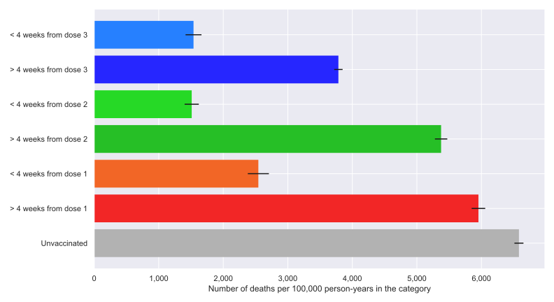
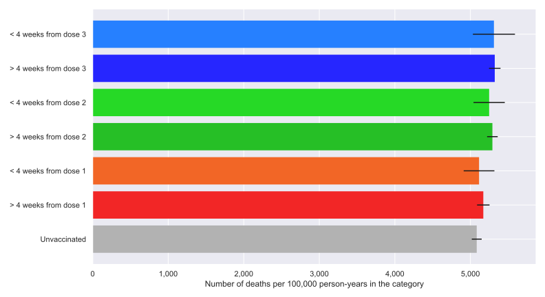

# Healthy Vaccine Effect

## HVE = 0.5, HVE_DURATION = 26, N_RUNS = 500


## HVE = 0, HVE_DURATION = 26, N_RUNS = 500 (sanity check)


# Install (Debian-based Linux)

## Python

```bash
apt install python3 python3-pip
```

## Python dependencies

```bash
pip install -r requirements.txt
```

# Run

```bash
python3 hve_main.py
```

## Tested on:

- Ubuntu 22.04, Python 3.11 
